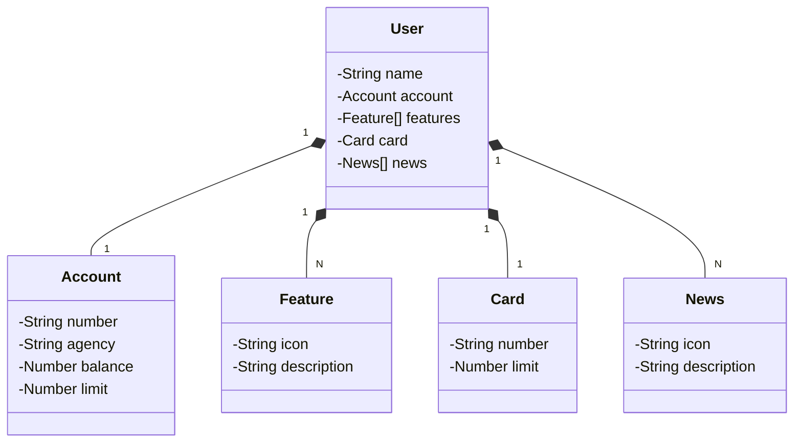

# 📂 Santander Dev Week 2023

## 📃 Java RESTful API criada para a Santander Dev Week.

## 🚀 Principais Tecnologias
 - **Java 17**: Utilizaremos a versão LTS mais recente do Java para tirar vantagem das últimas inovações que essa linguagem robusta e amplamente utilizada oferece;
 - **Spring Boot 3**: Trabalharemos com a mais nova versão do Spring Boot, que maximiza a produtividade do desenvolvedor por meio de sua poderosa premissa de autoconfiguração;
 - **Spring Data JPA**: Exploraremos como essa ferramenta pode simplificar nossa camada de acesso aos dados, facilitando a integração com bancos de dados SQL;
 - **OpenAPI (Swagger)**: Vamos criar uma documentação de API eficaz e fácil de entender usando a OpenAPI (Swagger), perfeitamente alinhada com a alta produtividade que o Spring Boot oferece;
 - **Railway**: facilita o deploy e monitoramento de nossas soluções na nuvem, além de oferecer diversos bancos de dados como serviço e pipelines de CI/CD.

## 💻 [Link do Figma](https://www.figma.com/file/0ZsjwjsYlYd3timxqMWlbj/SANTANDER---Projeto-Web%2FMobile?type=design&node-id=1421%3A432&mode=design&t=6dPQuerScEQH0zAn-1)

O Figma foi utilizado para a abstração do domínio desta API, sendo útil na análise e projeto da solução.

## Diagrama de Classes (Domínio da API)

## IMPORTANTE

Este projeto foi construído com um viés totalmente educacional para a DIO. Por isso, disponibilizamos uma versão mais robusta dele no repositório oficial da DIO:

### [digitalinnovationone/santander-dev-week-2023-api](https://github.com/digitalinnovationone/santander-dev-week-2023-api)

Lá incluímos todas os endpoints de CRUD, além de aplicar boas práticas (uso de DTOs e refinamento na documentação da OpenAPI). Sendo assim, caso queira um desafio/referência mais completa é só acessar 👊🤩

http://localhost:8080/swagger-ui/index.html

Conteúdo Json para realizar Cadastro

    {
      "name": "Wagner",
      "account": {
        "number": "00000000-0",
        "agency": "0000",
        "balance": 1327.67,
        "limit": 7000.00
      },
      "features": [
        {
          "icon": "URL",
          "description": "Descrição da Feature"
        }
      ],
      "card": {
        "number": "xxxx xxxx xxxx 0000",
        "limit": 5000.00
      },
      "news": [
        {
          "icon": "URL",
          "description": "Descrição da Novidade"
        }
      ]
    }

Banco de Dados Online PostgreSQL
[Railway](https://railway.app/)
 - New Project
 - Provision PostgreSQL
 - No projeto adicione uma nova Application PRD inserindo as informações do Connect a partir da PGDATABASE
Pela primeira vez para que seja criado as tabelas você deve alterar o conteúdo do arquivo application-prd.yml (ddl-auto: create), após criado retorne para (ddl-auto: validate) 

Deploy da API na Nuvem (Railway)
 - +New
 - GitHub Repo
 - Only select repositories
 - Disable Private Networking
 - Generate Domain
 - Settings
 - Shared Variables
   - SPRING_PROFILES_ACTIVE     prd
   
Nas configurações vá em variables e adicione as informações de acesso ao banco mais PORT=8080

---
---
## 📧 Contato
[LinkedIn](https://www.linkedin.com/in/wsawebmaster/)

wsawebmaster@yahoo.com.br
